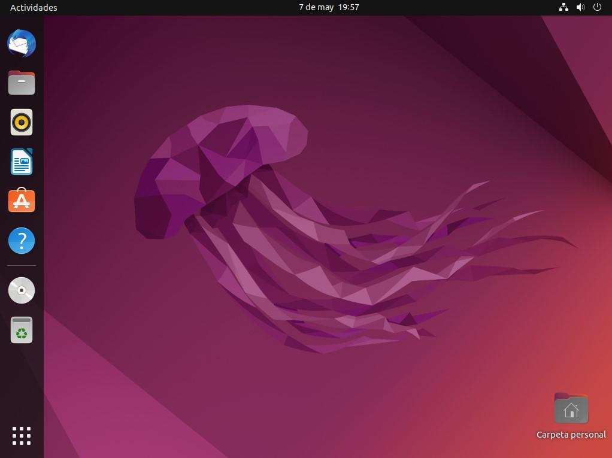
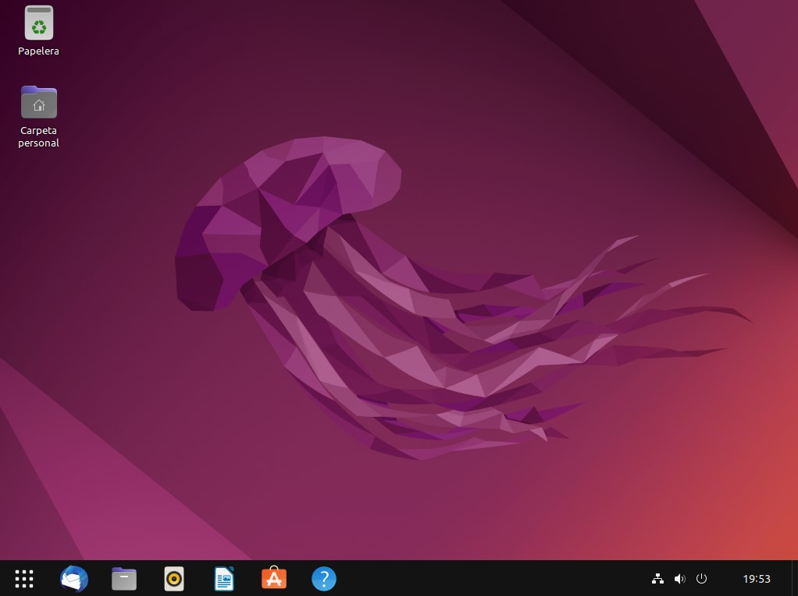

# make-ubuntu-22.04-look-like-windows-10
Script to make Ubuntu 22.04 look a bit like Windows 10.

Before:

After running this script twice:

# Howto use it
  1. sudo apt install curl gnome-shell-extension-prefs
  2. wget https://raw.githubusercontent.com/panreyes/make-ubuntu-22.04-look-like-windows-10/main/make_ubuntu_look_like_w10.sh
  3. chmod +x make_ubuntu_look_like_w10.sh
  4. ./make_ubuntu_look_like_w10.sh

# Why on earth?
These few details help common users a lot to migrate from Windows 10 to Ubuntu 22.04.

# Thanks to
These GNOME extensions developers:
  - Dash to panel: https://github.com/home-sweet-gnome/dash-to-panel
  - Remove Alt+Tab delay v2: https://github.com/bdaase/remove-alt-tab-delay
  - Start overlay in application view: https://github.com/Hexcz/Start-Overlay-in-Application-View-for-Gnome-40-

And borrowed some ideas from here:
  - gnome-layout-manager: https://github.com/vmavromatis/gnome-layout-manager

And everyone related to the amazing GNOME desktop software. 
For me, it is the best desktop out there! 🙌🏼
